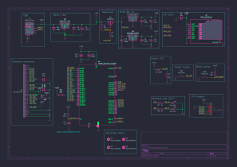
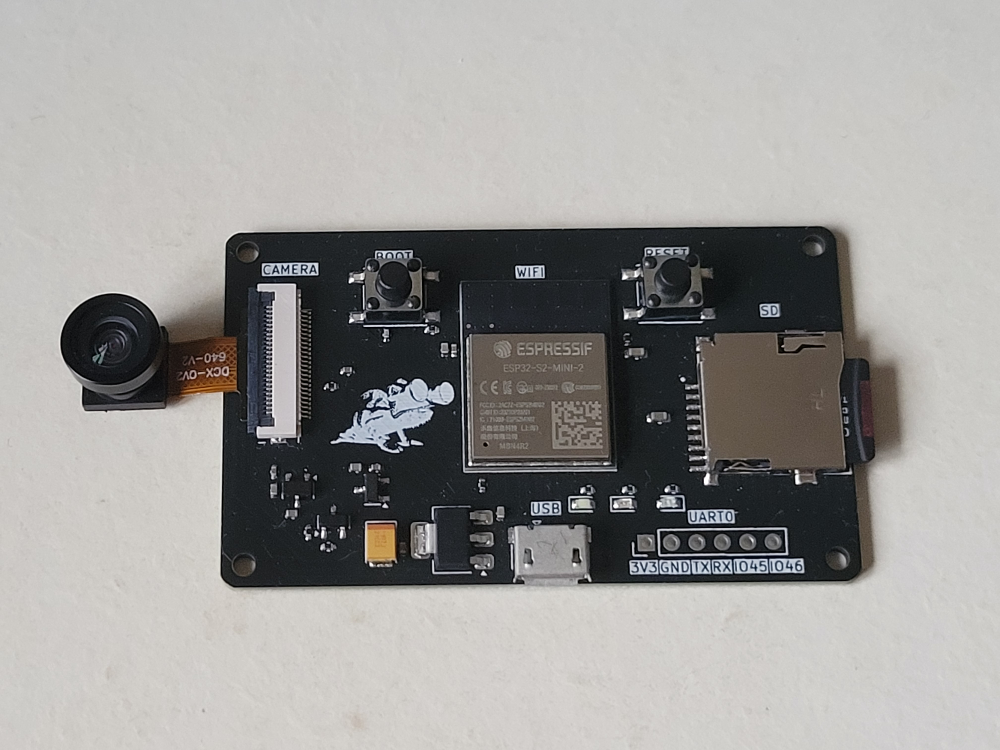
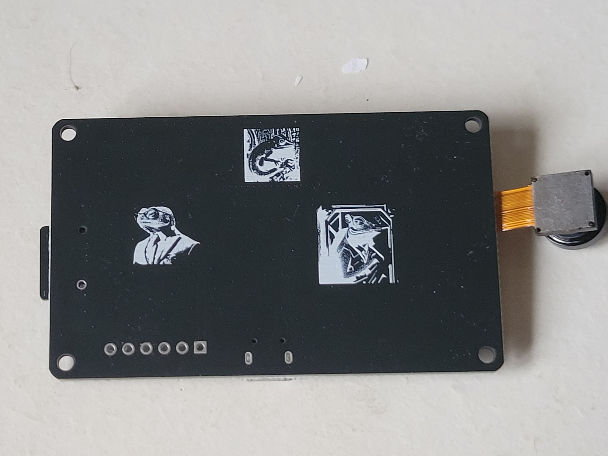

# ESPCameleon

# Summary of the project

ESPCameleon is an ESP32 Camera PCB. It takes most of its design from the AI Thinker ESP32-Cam and adapt it to use the ESP32-S2-MINI-2-N4R2. This board allow video capture and streaming through WiFi or USB.

## Schematics

## Features

- Micro-USB connector to directly program and power the board
- LDO converters, 3V3 for the ESP32, SD card and LED's, 1V2 and 2V8 for the camera
- RESET button to reset the ESP32 and BOOT button to activate the ESP32 USB boot mode
- FPC connector 24 pins for the camera (tested OV2640, should support OV5640 despite voltage difference)
- Micro-SD card reader to store videos
- White and yellow LED's for debugging and status indicating, red power LED
- Pin header to expose the ESP32 UART interface, some GPIOS, the 3V3 rails and GND

## PCB caracteristics

The PCB is a two layer board with single-sided assembly, the thinnest trace is 0.1562 mm and the vias have a 0.7 mm diameter ring and a 0.3 mm hole. The USB traces are as short and as thick as possible to be as close as possible to the 90 $\Omega$ impedance of the JLCPCB two-layer board stackup.

## Board results :

## Programming

The board can be "easily" programmed with both ESP-IDF and Arduino IDE but the later is much faster to get working.

For the arduino IDE, you just need to download the ESP32 boards configurations. Select board "ESP32S2 Dev module", enable "USB CDC on boot", "upload mode" as "internal USB". For the camera webserver example (File->Example->ESP32->Camera->CameraWebServer), you should set "PSRAM" as "enabled", enter your Wifi credentials and update the camera_pins.h to match the board (an example is given in my CameraWebServer2 repository).

An example of streaming through the USB port is available in the USBCameraStreaming repository. It contains an Arduino script to send JPEG images via USB and a Basic Flutter android app to receive and display the video stream.

## Current Issues and TO DO list

- There are traces and ground pours around the ESP32 antenna which interfere with Wifi communication (reduce range and sensibility to noise). The traces should be moved and the copper pours removed. An even better way, is to put the antenna outside of the PCB (see https://cdn.sparkfun.com/assets/5/2/8/9/4/esp32-s2_hardware_design_guidelines.pdf#page=15)
- The buttons are bulky, they could be changed or even replaced by a plated hole
- An external PSRAM could allow for a better image quality and allow to switch to an ESP32S2 without PSRAM included (cheaper and in Economic assembly for JLCPCB)
- The Micro-USB connector could be replaced with a more modern USB-C

Most of those issues are addressed in the ESP32CamelonV2 repository.
